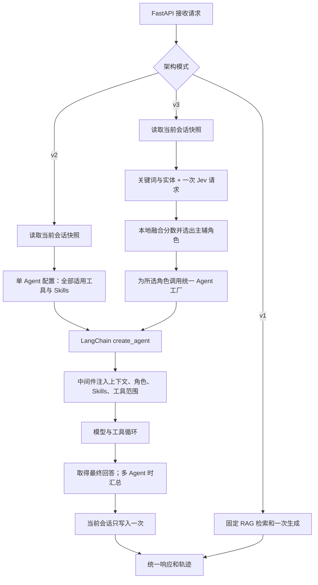

# EchoMind 项目转型计划

> 日期：2026-10-04（Asia/Hong_Kong）  
> 状态：设计与工作量评估，尚未实施。  
> 目标：迁移到 LangChain Agent 运行时，以中间件注入上下文、Skills 和工具范围；用 Typesafe.ai Jev 打分与关键词规则完成意图识别和路由；将个人跨会话记忆调整为已解决案例的共享检索。  
> 工时判断：两小时可以争取完成一条可验收的新架构闭环，不能据此承诺完整迁移。完整功能迁移与基本回归暂按 4–8 小时规划，外部接口或依赖兼容受阻时延长。估算不是模型速度实测或交付保证。

## 1. 已确定的方向与实施边界

### 1.1 本次讨论确定的方向

1. **当前会话记忆继续使用 Redis**：保留近期原始消息和累计摘要，用于理解当前问题、已提供的字段、已尝试的方法和未完成事项。
2. **普通客服默认不再读取同一用户的跨会话情景记忆，也不再每轮更新用户画像**。将来确有订单跟进或个性化需求时，再从明确的业务记录接入。
3. **长期共享内容改为已解决案例**：从已结束且有解决依据的对话中提炼可复用经验，允许同一业务共享范围内的不同用户检索。
4. **Agent 运行时迁移到 LangChain**：由框架承担模型与工具循环，通过中间件注入角色、Skills、会话上下文和工具范围，减少自写运行时逻辑。
5. **意图与路由改成 Jev + 关键词规则**：Jev 指用户确认的 Typesafe.ai Jev，不是 embedding，也不是原先的字符哈希相似度分支。

### 1.2 本计划采用的最小设计建议

- 保留 FastAPI、Redis、ChromaDB、现有知识库和工具的业务实现；先迁移执行方式，不同时重写检索算法或更换向量模型。
- 完整迁移保留 v1/v2/v3 的功能定位和统一输入输出合同。两小时阶段只验收一条新链路，不能称为三个版本全部迁移完成。
- 继续沿用当前 Skills 的关键词匹配和正文注入方式，不在本次同时引入渐进式披露或新的 Skill 选择模型。
- 不增加模拟订单、支付或退款后台；现有辅助工具的能力边界不变。
- 编码用的 GPT-6.1 Sol 与 EchoMind 在线回答用户所用的模型是两件事。本次框架迁移不自动替换业务生成模型。
- 不直接删除旧数据、覆盖现有基线或修改历史评测结果。新实现验收后再切换默认入口。

## 2. 当前实现及需要改变的地方

截至本次检查，核心实现与现有测试约 6,300 行；`agents/agent_orchestrator.py` 约 1,188 行。行数只用于说明范围，工时主要由接口耦合和验证工作决定。

| 部分 | 当前实现 | 迁移方向 |
|---|---|---|
| Agent 执行 | 手写 Anthropic `messages.create` 和 `tool_use/tool_result` 循环 | LangChain `create_agent` 与框架消息/工具循环 |
| 角色与 Skills | `BaseAgent` 拼接提示词，子类分配工具 | 角色配置 + 中间件注入，复用 Skills 加载器 |
| 意图识别 | 聊天模型分类、向量/字符哈希、关键词三路融合 | Jev 结构化判断 + 本地关键词规则 |
| 路由 | 意图映射、领域加分、紧急度、主辅选择及监控降权 | 明确的本地路由函数消费 Jev 与规则结果 |
| 当前会话 | Redis 近期消息、累计摘要 | 保留，明确一次请求只读写一次 |
| 情景记忆 | 压缩时写入个人历史摘要，按用户/会话检索 | 新建独立的 `resolved_cases` 案例集合 |
| 用户画像 | 每轮后台提炼并写入 ChromaDB | 从普通客服默认链路移除 |
| 结案 | 没有明确会话生命周期和解决确认接口 | 增加结束状态、解决结果、证据来源 |
| 监控/评测 | 直接依赖旧编排器、Agent 池和 Anthropic 响应类型 | 适配统一 Pipeline/事件合同，增加真实 API 链路验收 |

现状依据：[统一管线](agents/pipelines.py)、[旧编排器](agents/agent_orchestrator.py)、[记忆管理](memory/conversation_memory.py)、[API](api/main.py)、[依赖](requirements.txt)。

有两项[项目记录](项目记录.md)中的已有问题必须纳入迁移基线：

- 项目记录 P14：旧 `_search_episodic()` 使用不符合当前 Chroma 校验要求的多字段 `where`，异常后返回空列表。因此此前说明的个人情景记忆检索是设计路径，不能当作当前已验证生效的能力。新案例检索应使用正确的过滤表达式并做集成测试，不需要为被替代的旧路径先做完整重建。
- 项目记录 P15：监控可能把执行中的请求算作失败，并因延迟阈值过低误降权。迁移期间不能让这套旧指标未经适配就影响新路由。

现有 `success=True` 仅代表 Agent 执行/回答生成成功；`escalated` 仅是升级标记。二者均不能当作问题已解决的证据。

## 3. 目标架构与中间件分工

### 3.1 一次请求的数据流



### 3.2 配置阶段与执行阶段

- **启动时**：创建 LangChain ChatModel、工具适配器、Skills 管理器、Jev HTTP 客户端、存储服务与 Agent 工厂；固定可复用的角色配置。
- **请求时**：创建独立的运行上下文，包含用户/会话标识、权限、记忆快照和路由结果；执行模型与工具调用。共享 Agent 对象上不保存某个请求的消息、分数或工具轨迹。
- **结案时**：处理明确的结束/解决事件，再提取并发布案例。这不属于每轮回答的默认后处理。

### 3.3 中间件负责什么

LangChain 官方支持 `create_agent(..., middleware=[...])`，并提供异步模型/工具包装钩子。[自定义中间件文档](https://docs.langchain.com/oss/python/langchain/middleware/custom)

| 职责 | 建议位置 | 关键约束 |
|---|---|---|
| 角色、Skills、摘要等提示词注入 | `awrap_model_call` | 从请求快照构造本轮输入，不把同一背景反复追加到持久消息里 |
| 工具范围 | 模型调用前过滤工具；工具执行时再次校验 | 模型只看所选角色工具，执行端也校验允许范围 |
| 工具异常和轨迹 | `awrap_tool_call` | 保留工具调用 ID、参数、结果状态和耗时，不吞掉失败 |
| 模型用量和耗时 | 模型包装钩子或统一 callback，选定一个计数所有者 | 区分模型调用、工具调用、Jev 请求和完整 HTTP 耗时，避免双计数 |
| 调用上限 | 框架现成调用限制或少量状态逻辑 | 明确限制的是模型回合还是工具次数，并验证最后一轮行为 |

动态注入读取运行上下文和执行状态；身份、权限、客户端等由服务端提供，不能让模型通过工具参数选择其他用户身份。模型请求的 `override` 与持久状态更新是不同操作。[上下文工程文档](https://docs.langchain.com/oss/python/langchain/context-engineering)

以下职责继续是普通业务服务，不为形式统一而全部改成中间件：

- 知识检索、查询改写、重排、缓存和熔断；
- Jev 请求、关键词评分和最终路由决策；
- 会话存储、结案校验、案例提取与持久化；
- 多 Agent 的主辅调度与回答汇总。

**记忆只有一个读写所有者。** 本计划由顶层 workflow 读取会话并在最终回答后写回，中间件负责把快照注入模型。不能同时由 API、每个子 Agent 的 `after_agent` 和 checkpointer 各追加一次。第一阶段不再引入另一套持久化聊天历史；需要断点恢复时再单独设计 checkpointer 与 Redis 的分工。

**路由每个用户请求计算一次。** 单 Agent 原型可放在 `abefore_agent`；保留 v3 主辅协作时，在父 workflow 中一次计算并传给所有子 Agent。不能在每轮 `before_model/awrap_model_call` 中重新请求 Jev，也不能每个子 Agent 各算一遍。

### 3.4 三个版本如何保留

- **v1**：仍是固定检索 + 一次回答，不读写个人会话记忆、不注入 Skills、不向生成模型提供工具。生成部分可以统一使用 ChatModel `ainvoke`，无需强行包装成 Agent。
- **v2**：单个 `create_agent` 使用全部适用工具与命中的 Skills，有当前会话记忆，无领域路由。
- **v3**：Jev + 规则给出主辅角色；角色使用同一 Agent 工厂，分别注入工具和 Skills。保留主辅协作、失败处理及必要的汇总能力，不把“单 Agent 动态换提示词”冒充完整 v3。
- 保留 `PipelineInput -> PipelineResult` 和 `/chat` 响应字段；可增加路由原始分数、降级原因和案例引用，但不静默改变旧字段的含义。

## 4. Jev 打分与关键词路由

### 4.1 已核实的 Jev 能力

Jev 是 Typesafe.ai 的 System One 决策模型。REST 入口为 `POST https://api.typesafe.ai/v1/systemone`，使用 Bearer API key；输入包含 `model`、`state`、`questions`，输出包含命名答案。可以复用项目已有的 `httpx`，无需为了一个接口引入额外 SDK。[官方介绍](https://docs.typesafe.ai/introduction)、[OpenAPI](https://api.typesafe.ai/openapi.json)

三类返回值不能混淆：

- `choice`：互斥类别选择及候选概率，适合主意图分类；其 `confidence` 不是所选类别概率。
- `noul`：一个命题为真的概率，适合分别判断是否涉及技术、账单等领域，允许多个领域同时成立。
- `score`：有序量表的期望分数，适合等级评分，不能直接称为概率。

来源：[Choice](https://docs.typesafe.ai/primitives/choice)、[Confidence](https://docs.typesafe.ai/confidence)、[官方接口定义](https://api.typesafe.ai/openapi.json)。

官方发布说明中的延迟是供应商测试结果，不是本项目在香港网络环境下的 SLA。中文客服准确率、实际配额、服务可达性和账号权限尚未实测；实施前先做真实连通及中文样例验证。评测时固定可用的 Jev 版本，并记录返回的实际模型版本，避免依赖漂移别名。[Models](https://docs.typesafe.ai/models)、[发布说明](https://typesafe.ai/blog/introducing-system-one-models-and-jev)

### 4.2 最小路由流程

```text
当前问题 + 必要的近期上下文
  → 本地正则抽实体、关键词匹配
  → 一次 Jev 请求：主意图 + 各领域相关性 + 是否需要人工
  → 校验返回字段和取值
  → 本地融合规则
  → 强规则覆盖、低置信度处理、主辅选择
  → RouteDecision
```

建议一次 Jev 请求包含：`intent` 单选、技术/账单/通用/人工相关性的独立判断。复合问题不能只用单选结果表达。

`RouteDecision` 至少保留：

- 主意图、主 Agent、辅助 Agent；
- Jev 原始类别/领域概率；
- 命中的关键词与实体；
- 融合后的 `routing_scores`；
- 是否降级、降级原因、路由理由和 Jev 耗时。

关键词分数可由命中权重归一化得到。可试验 `S = α × Jev领域概率 + (1−α) × 关键词分数`，但权重、主域阈值、主次分差和辅助域阈值需要用标注验证集确定，不能把任意常数写成已验证的最优值。融合后的 `S` 是路由分数，不是校准概率。

路由优先级建议：

1. 明确的人工请求或已定义的高风险规则先处理；规则需要区分否定、引用和已解决语境。
2. 在可用领域中选择主 Agent；对复合问题选择达到条件的辅助 Agent。
3. 分数低、前两名接近或信息不足时，交给通用 Agent 澄清，避免强行分类。
4. Jev 超时、429、鉴权错误或返回不合法时，使用关键词降级，保留 `degraded=true`；关键词也不足则澄清，不伪造高置信度。

新默认路径移除旧聊天模型分类与字符哈希/向量投票，避免把 Jev 叠加成第四条判断链。旧实现只作为可回退基线保留。

## 5. 从个人情景记忆转为已解决案例

### 5.1 三类资料的边界

| 资料 | 用途 | 更新时机 |
|---|---|---|
| Redis 近期消息 + 累计摘要 | 当前用户这次会话的上下文 | 每轮回答后；必要时压缩 |
| 正式知识库 | 产品说明、业务政策、标准处理流程 | 文档导入或修订时 |
| `resolved_cases` | 相似问题曾经怎样被解决 | 已结束且确认解决后 |

移除普通客服链路中的每轮用户画像更新和个人跨会话检索。已有 `episodic/user_profile` 数据不直接复制到共享案例库：旧摘要没有结案状态、解决证据或共享内容清理，不能通过去掉 `user_id` 过滤就对其他用户开放。

### 5.2 结案条件与来源记录

将结束状态和处理结果分开记录：

- `status`：`open` / `closed`；
- `outcome`：`unknown` / `resolved` / `unresolved`；
- 解决证据：确认来源、确认时间、相应消息或业务结果引用；
- 案例发布状态：`pending` / `published` / `rejected`，以便失败重试且不污染检索。

只有 `closed && resolved`，且内容通过共享范围与质量检查，才能成为可检索案例。用户中断、超时、Redis 过期、Agent 返回成功、满意度表扬都不能单独完成这个判定。

先新增显式结案 API，由用户明确确认或人工处理结果触发；校验调用者和会话归属。模型可以整理候选案例，不能仅凭自己的回答把会话改成已解决。

当前 `user_id` 只是客户端提交的字段，不是可信身份凭据。开发闭环使用隔离测试数据和服务端可信测试身份/会话凭证；正式开放多用户结案前需要可靠的身份与会话绑定，不能只比较客户端自报的 ID。完整认证接入不属于两小时原型的交付承诺。

原始业务记录与共享向量索引分开：单机版本建议使用 Python 标准库 SQLite 保存会话处理记录、状态和解决证据，并挂载持久目录；Chroma 保存经过处理的案例。第一条闭环至少可靠保存结案证据和处理步骤快照；完整迁移再验证长会话记录和恢复逻辑。原始记录按身份隔离，不作为跨用户检索内容。

### 5.3 案例提取与入库

```text
显式结案事件
  → 保存 closed/resolved 状态和解决证据
  → 读取处理记录、近期消息、会话摘要
  → 提取问题、适用环境、实际有效步骤、结果
  → 移除用户专属信息，检查证据是否充分
  → 按稳定 case_id 幂等写入 Chroma
  → 标记 published
```

初始字段保持简单：问题、适用条件、有效处理步骤、结果、解决证据引用、来源引用、结案时间、有效状态；原因仅在已经确认时填写。案例保留产品、版本、错误码等可复用条件，去掉姓名、账号、订单号、联系方式和用户专属金额/状态。内部原始证据不直接暴露给其他用户。

“建议做过什么”和“实际做了什么”必须分开；不能将模型建议包装成已验证解决方案。Redis 800 字符摘要可能丢掉关键步骤，只能作辅助输入；信息不足时暂不发布。

短会话即使未达到 15 条消息，也能在显式结案时生成案例。压缩阈值不再决定共享知识的入库时机。

同一结案事件重复提交不得新增重复案例。提取或向量写入失败时保留待处理状态，不依赖一个不可恢复的 `asyncio.create_task()` 宣称已完成；可先用同步结案处理和可重试接口完成最小版本。问题重新打开或方案失效时，先撤销案例的检索资格，再决定是否更新重发。已关闭会话收到新消息时，应拒绝继续追加并提示新建会话，或通过明确的重新打开流程处理，不能默默继续沿用旧的已解决状态。

此结构参考客服知识管理对问题、环境、解决方法和可复用内容的区分。[KCS 案例结构](https://library.serviceinnovation.org/KCS/Knowledge-Centered_Success_Practices_Guide/301-Evolve_Loop/Practice_5_Content_Health/Technique_5.1)

### 5.4 检索与使用

- 新增 `search_resolved_cases` 工具，复用现有检索基础；v2/v3 由 Agent 按需调用，不必每轮强制搜索。
- 检索前过滤共享业务范围、已发布/有效状态和适用条件，再做语义召回；不是跨租户、跨权限全局搜索原始聊天。
- 返回问题、适用条件、解决步骤、案例 ID 与时间，作为经验依据；不返回其他人的身份和原始业务记录。
- 正式政策决定当前允许的操作。历史个例不能覆盖现行退款规则，也不能证明当前用户的订单状态。
- 案例是否有效由生命周期字段控制；向量相似度高不等于方案适用，不强制把无关的 Top-K 全塞进模型。

## 6. 代码迁移范围

以下是建议落点，可根据实现收拢文件，不要求为每个职责单独建包。

| 文件/区域 | 工作 |
|---|---|
| `requirements.txt`、Dockerfile/Compose | 增加兼容的 LangChain/provider 依赖，先验证再锁定版本；新增记录存储挂载 |
| `core/llm_utils.py` | 统一 ChatModel 构造、provider 参数和计量；保持现有兼容服务的工具调用与 thinking 配置有效 |
| `agents/tools.py` | 将已有 handler 接入框架工具；运行身份来自服务端 context |
| `agents/runtime.py`、`agents/middleware.py`（建议新增） | Agent 工厂、上下文/Skills/工具注入与轨迹；避免再造完整 Agent 框架 |
| `core/intent_recognizer.py` 与轻量 Jev 适配 | Jev + 规则，移除新路径中的旧三路融合 |
| `agents/agent_orchestrator.py` | 保留必要的主辅调度/汇总，删除被框架替代的手写工具循环；适配监控接口 |
| `memory/conversation_memory.py` | 收缩为当前会话记忆；保留消息与摘要的读写 |
| 案例服务（建议 `memory/resolved_cases.py`） | 状态/证据记录、案例提取、发布、检索、撤销和幂等处理 |
| `agents/pipelines.py`、`api/main.py` | 接入新运行时和结案 API；统一结果；防止重复读写记忆 |
| `mcp/tool_manager.py` | 复用 RAG 流程，迁移其中的模型调用并保留缓存/熔断语义 |
| `evaluation/evaluator.py`、`scripts/` | 接统一管线并增加 API 级记忆/结案测试；更新指标口径 |
| `monitor/performance_monitor.py`、`tests/` | 适配请求完成统计、框架消息类型、工具行为和新案例链路 |

“完整迁移”还包括 Agent 以外的生成调用：v1 回答、主辅汇总、RAG 改写/重排、会话摘要及合并、评测 Judge。Jev 本身走专用决策接口，不强行伪装成聊天模型。

当前依赖锁定了较旧的 Anthropic、Pydantic 和 Chroma 版本，不能假设直接安装最新版 LangChain 就兼容。先验证一次真实的模型→工具→模型往返，再批量迁移调用方。

## 7. 工时评估：GPT-6.1 Sol + ultra + Fast 能否两小时完成

### 7.1 模型设置的理解

本计划按“Codex 中使用 GPT-6.1 Sol，选择 ultra 推理档并启用 Fast”理解用户要求；不把它写成一个名叫 `gpt-6.1-sol-ultra-fast` 的 API 模型。

当前宿主暴露的模型设置支持 GPT-6.1 Sol 的 ultra 档；公开 API 模型页列出的 reasoning effort 到 `max`，不能直接推定两者参数映射。官方速度文档确认 GPT-6.1 Sol 支持 Standard/Fast；独立的 Ultrafast 服务档另有模型与访问条件，不与“ultra 推理 + Fast”混用。[模型文档](https://developers.openai.com/api/docs/models/gpt-6.1-sol)、[Codex 速度文档](https://learn.chatgpt.com/docs/agent-configuration/speed)

没有对本仓库使用该配置完成迁移的计时样本。更快的模型输出不能消除依赖安装、外部服务延迟、Docker 构建、真实工具联调和回归测试，因此不能按生成速度倍数推算工程完成时间。

### 7.2 两小时可争取的验收范围

前提：Jev 和业务生成模型均已具备可用凭证、网络正常；复用已有 Redis/Chroma/工具；使用清晰接口并行分工；不新增前端、不做旧案例批量迁移。当前这些连通和兼容前提尚未全部验证。

两小时目标是一个可切换的新运行时入口，跑通：

1. 一个 LangChain Agent，能通过中间件注入角色/Skills/当前会话背景，并正确执行真实工具回合。
2. Jev + 关键词对新路径完成一次真实路由判断，主角色的提示词和工具范围随结果变化；失败有明确降级。
3. Redis 继续当前会话，普通链路不再更新画像或读取个人跨会话历史。
4. 显式“已解决并结束”事件生成一条有证据、去身份化的案例，并能被另一测试用户检索。
5. 未解决/仅关闭不入共享库、会话隔离、重复结案幂等等关键检查通过。

这个阶段可以只覆盖主角色，保留旧 v1/v2/v3 作为基线。尚未迁移的主辅并行、全部辅助模型调用、全量评测和监控适配要明确标记；**不能宣称完成整体架构替换**。Jev 只做了 mock 或关键词回退，也不算完成 Jev 接入。

建议两小时安排：

| 时间 | 工作 | 退出条件 |
|---|---|---|
| 0–15 分钟 | 固定输入输出合同、验证依赖和两个外部服务 | 跑通真实工具往返与 Jev 样例；失败则立即重新估时 |
| 15–65 分钟 | 并行：Agent/中间件；案例/结案；Jev/规则 | 三条线各自通过有意义的行为检查 |
| 65–90 分钟 | 由一个整合者接 API、记忆与结果统计 | 新入口跑通完整请求和结案 |
| 90–115 分钟 | 跨用户案例复用、隔离、失败和幂等验收 | 关键场景有实际结果记录 |
| 115–120 分钟 | 记录已完成、失败项、待迁移模块 | 不以占位代码或未运行检查宣布完成 |

如果只有一个串行执行者，或者前 15 分钟接口/依赖验证未通过，两小时目标应缩减为框架与路由原型，将案例闭环留到下一阶段，并如实标记未完成。

### 7.3 完整迁移的预算

以下是基于当前耦合范围的工程估算，按模块顺序处理合计约 4–8 小时；并行可压缩部分时间，但集成与最终验证仍在关键路径上。

| 工作包 | 估算 |
|---|---:|
| 依赖/provider/Jev 连通验证，确定合同与迁移基线 | 20–40 分钟 |
| LangChain Agent、工具适配、中间件、v2 接入 | 45–90 分钟 |
| Jev + 关键词融合、低置信度处理、路由验证 | 30–60 分钟 |
| 当前会话记忆、结案/证据、案例入库检索与幂等 | 45–90 分钟 |
| v1/v3、主辅汇总、辅助模型调用与统一接口迁移 | 40–80 分钟 |
| 评测/监控适配、真实联调、Docker 与基本回归、文档 | 60–120 分钟 |
| **合计** | **240–480 分钟** |

上述预算适用于本项目原型级完整迁移和基本回归，不等于生产可靠性认证。若需要处理 provider/依赖冲突、长会话数据修复、并发重试/崩溃恢复、较完整的中文路由校准及大规模评测，建议预留 **1–2 个工作日**。

推荐并行拆分为运行时、案例服务、Jev 路由三块。`api/main.py`、统一合同与最终整合由一个负责人维护，避免多人同时重写接缝。开始实施前记录已有未提交改动并建立可回退基线，不能把用户正在修改的文件恢复或覆盖。

## 8. 验收与评估口径

### 8.1 最小行为验收

- [ ] 真实 provider 能完成至少一轮模型→工具→模型调用，参数与工具结果正确配对。
- [ ] v3 或新路由入口每个请求最多做一次逻辑路由判断；Agent 工具循环和主辅调用不会重复分类，网络重试次数单独记录。v1/v2 不调用 Jev 路由。
- [ ] 中文单领域、复合问题、否定人工请求、信息不足、Jev 超时/429均有预期结果。
- [ ] 角色工具范围在提示侧和执行侧一致；并发请求不共享用户上下文或轨迹。
- [ ] 当前会话每轮只写入一组用户/助手消息；消息不会同时被旧 API 和新中间件重复追加。
- [ ] 未解决、仅关闭、用户消失、模型回答成功均不能进入共享案例库。
- [ ] 短会话明确结案可以入库；原始证据缺失或无法提炼有效方法时拒绝发布。
- [ ] 重复结案只产生一个案例；写入失败可重试；撤销后不再被召回。
- [ ] 已关闭会话的新消息被拒绝，或经过明确的重新打开流程并先撤销旧案例；结案权限不依赖客户端自报的用户 ID。
- [ ] 用户 B 可检索用户 A 已发布的通用解决经验，但拿不到 A 的身份、订单及原始对话；越权业务范围不可检索。
- [ ] v1/v2/v3 的功能定位与响应合同得到验证；原有工具业务断言继续成立。

### 8.2 质量与成本比较

- 路由：标注集上的意图 macro-F1、主域准确率、复合问题辅助域召回、人工升级误报/漏报，以及 Jev p50/p95、错误率和调用成本。
- 案例：检索相关性、适用条件匹配、解决证据完整性、无案例时的退化行为；用真实确认事件统计解决率，不能将 LLM Judge 分数等同解决率。
- 运行时：工具执行成功率、回答质量、整次 HTTP p50/p95、生成模型 token、Jev 用量、结案提取成本分别记录。

现有 Evaluator 直接调用编排器，不能验证 `/chat` 的真实 Redis/结案流程，必须补 API 级链路检查。原有 fake Anthropic 测试通过也不能代替新框架和真实 provider 的集成验证。

对比时冻结模型、正式知识库和案例快照，显式控制缓存。若比较三个架构的案例检索能力，给三个版本同样的候选资料：v1 通过固定检索 hook 使用案例，v2/v3 按需调用工具；v1 仍不读写个人会话记忆。另做“关闭/开启案例库”的消融，避免把新增案例数据的收益归因于 LangChain 本身。

评测用来确认结果的对话，不能先入库再拿同一案例检索评测；至少按案例来源拆分，条件允许时按时间拆分。测试数据可以是明确标注的夹具，但不能冒充真实已解决业务案例。

## 9. 开始实施前需要验证的事项

1. Jev 凭证、可用模型版本与本地/容器网络；中文样例的输出字段和评分含义。
2. LangChain 与当前 provider 的实际兼容版本，以及工具调用、thinking 参数、用量字段。
3. 结案事件和案例字段合同；第一阶段确认方式按显式用户/人工确认为准。
4. 多用户共享的业务范围和案例发布条件；默认仅在本项目单一业务范围共享去身份化案例。
5. 第一阶段采用可切换新入口，还是立即迁移默认入口；建议先保留旧入口，关键验收通过后再切换。

本文件记录的是实施计划。创建本文不代表已启用 LangChain/Jev、已迁移任何业务数据，或已验证两小时交付时间。
