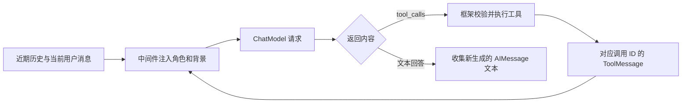
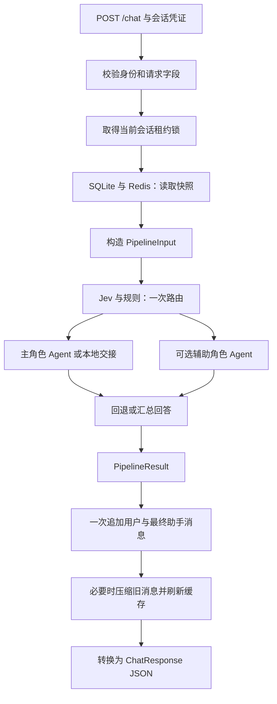

# 多agent编排客服：当前实现架构

更新日期：2026-10-04。本文描述新项目当前代码中的 **v3 实现**，用于理解模块职责、对象构建过程和一次请求的运行数据流。

项目位置：`/Users/yiyang/PycharmProjects/多agent编排客服`。运行入口为 [main.py](main.py)，启动和接口调用方式见 [README.md](README.md)。`docs/` 中的转型计划、项目记录和架构演进计划是迁移输入快照；当前行为以 `app/` 代码为准，验证记录见 [实现与验证.md](docs/实现与验证.md)。

当前系统以“每轮一次路由、主辅角色执行、统一返回和保存”为主线。普通聊天使用当前会话的近期消息与累计摘要；只有用户明确结案且证据有效，处理经验才进入可共享的已解决案例库。

## 1. 最底层：业务函数提供什么能力

[app/business_tools.py](app/business_tools.py) 提供普通 Python 业务函数：解释错误码、生成排障计划、检查必要字段、计算金额差值、整理人工交接摘要等。它们接收当前请求信息和工具参数，返回结构化 `dict`。

这些函数负责确定性处理，不负责选择 Agent，也不负责模型调用。例如，`compare_amounts` 可以计算用户给出的两个金额之差，但无法证明某笔交易重复扣款；`create_handoff_summary` 生成交接材料，但没有真实工单或转接系统。

正式政策和历史案例分别由检索服务提供。现有实现没有订单、物流、支付、退款或账号后台的访问能力。

## 2. 工具层：让模型能够调用业务能力

[app/tools.py](app/tools.py) 用 LangChain `@tool` 包装底层函数和检索服务，增加工具说明、参数 schema 和运行上下文注入。模型选择工具名称与业务参数，框架验证参数并执行对应异步函数。

工具通过 `ToolRuntime[RunContext]` 取得可信的身份、业务范围、路由和请求信息。`runtime` 不属于模型可填写的业务参数；模型不能通过工具参数改写 `user_id`、`conv_id` 或 `scope`。工具函数返回 `dict`，Agent 框架将执行结果包装为与原调用 ID 对应的 `ToolMessage`，交回模型。

角色配置保留三个公共工具：`search_knowledge_base`、`search_resolved_cases`、`create_handoff_summary`；工具白名单统一从 [app/profiles.py](app/profiles.py) 的 `AgentProfile.tool_scope` 派生。

| 角色 | 新增的专属工具 | 职责 |
|---|---|---|
| `general` 通用客服 | `inspect_request_context`、`suggest_required_fields` | 理解诉求、澄清问题、补齐必要字段、说明标准流程 |
| `technical` 技术客服 | `lookup_error_code`、`build_diagnostic_plan` | 解释错误和给出低风险排障步骤 |
| `billing` 账单客服 | `check_billing_fields`、`compare_amounts` | 核验用户已提供的字段，解释政策并计算金额差值 |
| `escalation` 人工升级客服 | `inspect_request_context` | 整理需要人工处理的问题及交接材料 |

通用、技术和账单角色的白名单在模型调用前限制可见工具，并在实际执行工具时再次检查。工具失败会返回保留原 `tool_call_id` 的错误消息，避免模型请求与工具响应失配。表中的 `escalation` 保留人工升级角色契约和权限配置，但自动升级路径直接调用本地交接函数，不进入模型或工具循环。

## 3. Agent 层：框架负责模型与工具循环

[app/runtime.py](app/runtime.py) 的 `V3Pipeline` 使用同一套 `create_agent` 构建方式创建通用、技术、账单 **三个 LangChain Agent 图**。它们共享生成模型和工具对象，角色权限及请求数据通过独立 `RunContext` 传入；`escalation` 是本地确定性交接节点。

[app/profiles.py](app/profiles.py) 恢复旧角色的完整 `AgentProfile` 配置：`role`、`mission`、`workflow`、`input_contract`、`output_contract`、`handoff_conditions`、`tool_scope`，并保留模型配置字段。中间件将职责、处理顺序、预期输入、输出要求和升级条件注入提示，再附上确定性的角色输入包：通用分诊目标、技术诊断字段或账单核验字段及缺失项。角色契约是提示约束，未对回答启用硬性结构化 schema；未提供的输入不能当作已确认事实。原契约中的用户画像和四级紧急度仍未接入。

| 角色 | 温度 | 最大输出 tokens | 实际执行 |
|---|---:|---:|---|
| `general` | 0.3 | 900 | LangChain 模型/工具循环 |
| `technical` | 0.1 | 1200 | LangChain 模型/工具循环 |
| `billing` | 0.0 | 1100 | LangChain 模型/工具循环 |
| `escalation` | 0.0 | 500 | 保留配置；本地交接不调用生成模型 |

前三个角色的温度和输出上限通过每次模型请求的 `model_settings` 覆盖，不修改共享 ChatModel；当前没有按角色切换模型。

一个角色的最小运行链路如下：

具体的数据类型变化是：历史中的 `dict` 转为 `HumanMessage` / `AIMessage`，再追加本轮 `HumanMessage`；`agent.ainvoke()` 返回含 `messages` 的图状态；运行时收集本轮新增的 `AIMessage` 文本，形成角色输出 `{role, success, response, error?}`。工具轮中已经生成的解释文字也会保留，历史回答不会重复收集。

模型决定是否调用工具，LangChain 负责执行循环，项目中间件负责注入约束、校验权限和记录轨迹。当前没有另外手写一套模型/工具循环，也没有给 Agent 配置持久化 checkpointer。

### 中间件与 Skills

`CustomerMiddleware.awrap_model_call` 在每次角色模型调用前构建系统消息，包含全局业务边界、完整角色契约、命中的 Skills、当前会话累计摘要、本轮路由的意图、实体和澄清标记，以及角色输入包。摘要与路由作为背景传入，不追加为持久会话消息。

[app/skills.py](app/skills.py) 在启动时读取 `skills/`，根据当前消息关键词和角色筛选内容；单个 Skill 正文默认预算为 3200 字符，整体提示预算为 5000 字符。它提供业务流程说明，支持 `/skills/reload` 重新加载。目前采用匹配后注入正文的方式，没有逐级读取 Skill 文件的工具流程。

政策数字、期限和条件应由正式知识库提供，这是系统提示中的要求；代码没有对每一句政策回答做强制引用校验。Skills 和历史案例不能替代正式政策或证明当前用户的业务状态。

每次通用、技术或账单角色执行默认最多调用模型 **4 次**，最后一次撤下工具并要求输出回答；执行层同时拒绝最后一轮继续运行工具。回退会创建新的通用执行上下文，有自己的一份调用预算。这是每角色的模型回合上限，查询改写、重排及父流程汇总另有模型调用，整次请求不受“总共 4 次”限制。

## 4. 父流程：一次路由后组织主辅角色

父流程输入为 `PipelineInput`，包含本轮消息、可信身份、会话 ID、业务范围、累计摘要和近期历史；输出为 `PipelineResult`，包含最终回答、路由结果、工具轨迹、检索资料和用量。

### Jev 与本地规则

[app/routing.py](app/routing.py) 每轮只调用一次 `Router.route()`。配置凭证时向 Typesafe.ai 发起一次 HTTP 请求，当前固定模型版本为 `jev-1.13.0`；无凭证时不发请求，使用本地规则。请求内容包含当前消息、最近最多 6 条历史消息及摘要，返回结果经过严格结构和概率校验。

**Jev 有效时只按 Jev 路由，Jev 不可用时才用关键词兜底**，两种模式不混合打分。详细依据、实测数据和取舍见 [路由修改建议与实施记录](docs/路由修改建议.md)。

Jev 一次请求回答三类问题：五选一主意图（`general/technical/billing/escalation/unknown`）、四个领域各自独立的相关概率，以及"用户是否明确表示紧急"的概率。Jev 模式的判定顺序：

1. 紧急概率 ≥ `0.8`，或 Jev 选 escalation 且该选项概率与升级相关概率都 ≥ `0.6`：交给人工升级节点。
2. Jev 以 ≥ `0.5` 的概率选 unknown：交给通用角色澄清。
3. Jev 以 ≥ `0.5` 的概率选通用、技术或账单：该角色为主角色。
4. 五选一不够确定时，取相关概率最高的领域，低于 `0.5` 则澄清；平局时技术、账单优先于通用。
5. 技术、账单中非主角色的一方，相关概率 ≥ `0.85` 时作为辅助角色并行。

这些门槛按 78 条真实 Jev 样例设定（`docs/jev-routing-calibration.json`，其中 16 条多轮样例的上下文来自真实 `/chat` 对话）；同一批样例复测见 `docs/routing-verification.json`，不是留出集上的准确率。发给 Jev 的是当前消息原文、最近 6 条消息（含客服回复，每条最多 2000 字）和会话摘要（最多 4000 字），用户原话不做脱敏。Jev 模式下关键词和正则信号不改变路由，只用于给升级回复挑选对应的知识库止损章节。

关键词兜底模式（Jev 超时、网络或 HTTP 错误、响应不合法、未配置凭证）：

- 按知识库章节整理的领域词表打分，每个正则组只计一次权重，除以 3 并封顶为 1；问候语不计分。401/500 保留数字边界，排除"500元""ABC401999"。
- 按优先级识别升级信号：明确要人工、账号或资金安全、诈骗、商品安全、投诉或法律纠纷、紧急。识别时排除否定、引用、预防性和已解决的表述，"能不能 / 可不可以"按疑问处理，"怎么投诉"按流程咨询处理。
- 最高关键词分低于 `0.5` 时澄清；平局时专业角色优先。
- "还是不行"一类续接语句，向前最多看 3 条用户消息借分（乘以 0.8），都没有再看会话摘要。
- 辅助角色沿用原项目规则：先看技术、账单协作关键词；没有时再看分数 ≥ `0.45` 且不低于主角色 `0.55` 倍。
- 不额外重试 Jev，降级原因记录在 `degraded_reason`。
- 角色可用性以运行时注册集合为准，主角色缺失时选可用角色或通用回退，辅助角色缺失时过滤。通用角色必须注册。这不是在线健康评分，没有恢复旧 Monitor 的成功率或延迟降权。

### 角色执行与汇总

路由后，父流程为每个选中角色新建 `RunContext`，使用 `asyncio.gather()` 并行执行。各角色得到相同的当前问题和会话背景，但有自己的工具白名单、调用次数、轨迹与检索结果列表；它们在执行途中没有互相发送消息。

例如“登录报错 401，同时付款金额不一致”满足复合域规则时，技术角色处理登录问题，账单角色核验金额信息；两份成功输出再由生成模型汇总为一份回答。

每个技术或账单执行分支，无论是主角色还是辅助角色，失败后都独立尝试一次通用回退，不重新路由；通用回退失败后停止该分支。原执行与回退的所有模型/工具尝试仍保留。只有一份成功输出时直接返回；多份成功输出时，Composer 优先组织主处理分支的有效结果，去除重复，要求冲突结论明确标为需核验，并注入通用 Skills 输出边界。Composer 使用温度 `0.1`、最大输出 `1000` tokens；失败则保留首份回答，后续加“补充说明：”并标记降级；全部分支失败时返回失败提示。

路由到 `escalation` 时，本地节点不调用生成模型，按升级原因从知识库按标题读取对应章节作为止损说明（人工客服与投诉、账号被盗与异常登录、防诈骗提醒、商品安全问题），不走向量检索；读取失败时省略该段。回复只展示中文原因、有值的订单号/金额/日期/错误码，紧急时注明优先级，不展示内部路由代码。自动交接结构保存在 `extra.handoff_summaries`，紧急时优先标记为 `CRITICAL`，否则为 `UNKNOWN`；LLM 角色的输入包仍不含四级紧急度。升级标记沿用路由、交接工具或本地节点的事件结果，不根据回答中出现人工相关关键词自动升级；这些都不执行真实转接。

`success=true` 表示至少有一个执行分支取得可用输出，包括本地交接输出，辅助分支可能仍失败。`extra.agent_results` 保留各原角色及回退的所有尝试，`extra.role_results` 保存每个分支最终结果和原请求角色；模型与工具轨迹也包含失败尝试。它不表示所有子问题已处理完，更不表示用户问题已经解决。

## 5. API 层：身份、会话读写与完整数据流

[app/main.py](app/main.py) 将父流程封装为 FastAPI 服务。它在编排能力之外，增加请求校验、身份验证、会话并发控制、最终持久化和 HTTP 响应转换。

一次 `/chat` 的执行顺序：

1. 验证签名凭证；请求中显式填写的身份或会话必须与凭证一致。
2. 锁定会话，检查会话归属和打开状态，读取近期消息及累计摘要。
3. 构造 `PipelineInput`，执行路由、选中角色的 Agent 或本地交接节点，以及必要的汇总。
4. 顶层 API 调用一次 `append_turn()`，在同一 SQLite 事务中保存本轮用户消息、最终助手回答及工具轨迹。
5. 若历史超过摘要阈值，压缩旧消息；随后刷新 Redis 快照。
6. 将 `PipelineResult` 转为字典，补充会话和兼容字段，通过 `ChatResponse` 返回 JSON。

子 Agent 和中间件不追加会话消息，因此不会把多个角色的中间答案重复写入历史。同一会话的锁覆盖读取、生成和写入，不同会话可以并发处理。

### 身份模型

[app/auth.py](app/auth.py) 使用 Base64URL JSON 加 HMAC-SHA256 签名的会话凭证，绑定 `owner/scope/conv_id` 和过期时间，默认有效期 24 小时。凭证有完整性校验，内容不加密。

`POST /sessions` 使用 `X-Dev-Key` 创建会话，用户 ID 由这个可信开发入口提交，业务 `scope` 由服务端配置决定。后续接口使用 Bearer 会话凭证。当前是本地开发身份闭环，生产登录、用户目录、凭证刷新和单独吊销机制尚未接入。

## 6. 配置阶段与执行阶段

`create_app()` 读取配置；FastAPI 启动时的 `lifespan` 构造共享服务，并放入 `app.state.services`：

| 启动时构造的对象 | 运行职责 |
|---|---|
| 一个 `httpx.AsyncClient` | Jev 与 embedding HTTP 请求 |
| 一个 `ChatAnthropic` | 角色生成、查询改写、重排、汇总、会话摘要和可选案例提取 |
| `KnowledgeIndex` | 正式知识库与案例向量集合 |
| `SessionStore`、`CaseService` | 会话持久化与案例生命周期 |
| `Router`、`SkillManager` | 一次路由与 Skills 匹配 |
| `V3Pipeline`、三个 Agent 图和本地交接节点 | 按请求上下文执行编排 |

创建模型和 Agent 对象时不会自动发出生成请求。启动阶段会连接 Redis 并执行 `PING`、初始化 Chroma、加载 Skills；模型请求发生在实际聊天、摘要或案例提取阶段。知识库导入由独立脚本执行，不是每次启动自动重新导入。

当前共享生成模型配置默认是 `deepseek-v4-flash`，通过 DeepSeek 的 Anthropic 兼容接口调用，关闭 thinking，默认最大输出 1600 tokens，超时 60 秒且无 SDK 重试。角色请求和 Composer 按上文配置覆盖温度及输出上限，其余辅助调用继续使用共享默认配置。本地 embedding 使用 `text-embedding-bge-m3` 的 HTTP 服务。Jev、生成模型和 embedding 各自承担不同职责。

共享对象保存配置与服务连接；用户数据、角色计数和工具轨迹保存在请求内上下文。用量通过 `ContextVar` 隔离，同一请求的并行调用合并计量，不同请求不会共用一份统计。

## 7. 当前会话记忆：SQLite 为准，Redis 缓存

[app/storage.py](app/storage.py) 将会话、原始消息、摘要、工具轨迹、解决证据和案例状态保存到 `data/records.sqlite3`，启用 WAL，数据库文件权限设为 `0600`。

Redis 保存当前会话的快照，键按身份、业务范围和会话隔离，默认 TTL 为 24 小时。读取快照时先取得 SQLite 数据及版本，再检查 Redis 版本；缓存缺失、损坏或落后时从 SQLite 恢复。Redis 过期不会删除原始会话，也不会自动结案。运行期间缓存故障可依赖 SQLite 继续保存记录，但应用启动仍要求 Redis `PING` 成功。

近期历史默认保留 **14 条消息记录，通常约 7 轮对话**。普通第 8 轮产生 16 条记录时，前 2 条进入摘要，后 14 条保留；后续摘要将旧摘要和新增旧消息合并。800 字是摘要提示约束，代码没有硬截断模型结果。摘要失败不会推进压缩位置，近期历史可能暂时超过 14 条，以保留上下文。

摘要不会删除 SQLite 原始消息。目前没有自动清理原始记录的保留期任务，普通聊天也不加载个人跨会话记忆或更新用户画像。

会话锁由 SQLite 租约实现：等待最多 30 秒、租期 60 秒、每 20 秒续租。它用于共享同一数据库的本机进程。存储层对同一会话、同一 `request_id` 的写入幂等；新的 HTTP 请求会生成新的请求 ID，所以不能把客户端重复发送请求理解为自动去重。

## 8. 正式知识库与已解决案例库

两类资料共用 bge-m3 向量服务和 Chroma 访问层，但使用不同集合、处理流程与可信边界。

| 资料 | 默认集合 | 作用与存放内容 |
|---|---|---|
| 正式知识库 | `knowledge_base__text_embedding_bge_m3` | 政策、产品说明、标准流程及对应片段 |
| 已解决案例 | `resolved_cases_v3` | 经证据校验后发布的通用问题、环境、有效步骤、结果及适用字段 |

默认 Chroma 路径是新项目 `data/chroma/`。可配置只读远端正式知识库，导入脚本拒绝修改远端集合；案例集合始终使用新项目本地存储。

### 正式知识库检索

[app/retrieval.py](app/retrieval.py) 的 `search_knowledge()` 执行：

1. 生成模型将查询改写为最多 3 个不同表达，与原查询去重合并。
2. 并行处理各查询：向本地 bge-m3 请求向量，再向 Chroma 召回片段。
3. 按片段 ID 合并去重；每个查询的目标召回数为 `max(top_k, rag_recall_k)`，其中 `rag_recall_k` 默认为 5，实际数量受集合记录数限制。
4. 去重后的候选数超过 `top_k` 时，由生成模型输出候选索引顺序进行重排。
5. 返回 `success/results/reranked`，发生可恢复故障时附带降级标记和原因。

改写失败使用原查询，重排失败保留召回合并顺序。召回缓存默认 300 秒、最多 512 项，缓存单个查询的召回结果；它不缓存整份回答，缓存命中仍可能发生改写和重排。连续 5 次召回失败触发 60 秒熔断，之后允许一次恢复探测。

返回 `score` 是 `1 - 余弦距离`，重排后仍保留原召回分数，不是重排置信度。正式知识检索目前没有最低相似度门槛，返回非空结果不自动证明资料足以回答问题。

知识库导入脚本读取 Markdown 章节，进行约 500 字符的句子切块，批量 embedding 后写入集合；重导时替换已导入标题的旧片段并清除召回缓存。当前导入记录为 26 篇、26 个片段。

### 已解决案例检索

`search_resolved_cases` 从可信上下文取业务 `scope`。向量查询前用 `$and` 限定 `scope + published + active`，可加入非空产品、版本、错误码的精确过滤；默认相似度门槛为 `0.35`。

之后 `CaseService.search()` 再核对 SQLite 中的业务范围、会话已关闭、结果已解决和实时发布资格，以 SQLite 的公开 payload 返回结果。案例检索没有正式知识库那套模型改写和重排。

正式知识库用于政策依据，案例用于参考处理经验。案例不会向其他用户提供原始聊天、身份或内部证据 ID，也不能证明当前用户的订单、支付或账号状态。

## 9. 结案与案例发布：独立于回答成功

三个状态维度分别维护：会话 `open/closed`，处理结果 `unknown/resolved/unresolved`，案例发布 `pending/published/rejected`。回答成功、用户表扬、缓存过期或用户离开，都不会自动产生已解决案例。

`POST /sessions/{conv_id}/close` 接收用户的明确确认，或引用本会话已有的原始用户消息作为证据。当前仅支持用户确认，没有人工坐席或业务系统确认的接入。

证据校验要求：确认属于当前会话和当前重开周期，明确表示问题已解决；每项 `actual_steps` 必须在确认原文中得到支持，环境信息必须有用户原文依据。后续用户表示仍未解决或出现当前新问题，会使旧证据失效。助手消息不能充当解决证据；用户确认中被规则识别出的否定、引用助手结论等表达会被拒绝，尚未覆盖所有第三方转述形式。

发布过程如下：

1. 从用户原始记录构造可复用候选，通过规则去掉身份、联系方式、订单、金额及用户特定完成状态；原始证据仍保存在私有 SQLite 中。
2. 可选模型提取只接收清理后的候选内容，输出仍需通过字段白名单、来源支持、步骤不变和隐私检查。调用或 JSON 解析失败可回退到合格的本地候选；能解析但字段或内容不合格的输出会被拒绝。
3. 使用按会话稳定生成的案例 ID，先保存 SQLite `pending` 状态，再幂等写入案例向量集合；写入成功后才标为 `published` 并启用。
4. 向量写入失败保留 `pending`，由 `/cases/retry` 显式重试；证据不足的 `resolved` 请求降为 `unknown` 并拒绝发布。

关闭接口等待上述过程完成，不是后台异步投递。重复结案不会新增案例。规则脱敏和原文匹配是当前实现方式，不代表已经完成所有场景下的匿名化或业务事实核验。

撤销时先在 SQLite 取消检索资格，再尝试删除向量；即使删除失败，检索的 SQLite 复核也会挡住已撤销案例。重开会话同时撤销旧案例并记录新的证据位置下限，旧确认不能再次发布。关闭会话拒绝继续聊天，需要显式重开或创建新会话。

## 10. 计量、追踪和返回字段

[app/models.py](app/models.py) 通过统一 callback 记录实际生成模型请求次数、成功与失败、输入输出 tokens 和耗时。各阶段统计口径为：

| 位置 | 统计范围 |
|---|---|
| `/chat` 的 `llm_calls/input_tokens/output_tokens` | 角色 Agent、知识查询改写与重排、主辅汇总 |
| `extra.jev` | Jev 请求次数、实际版本、耗时、概率与供应商 usage |
| `extra.memory_usage` | 本轮保存之后发生的会话摘要模型调用 |
| 关闭接口的 `extraction_usage` | 可选案例提取模型调用 |

一次已验证的政策问答产生 6 次生成调用：Agent 2 次、两次知识检索各自改写与重排共 4 次；另有 Jev 1 次。这说明调用一次工具可能引发额外模型请求。不同供应商 token 口径不能直接当作统一金额。

工具轨迹包含角色、工具名称、调用 ID、参数、成功状态和耗时。助手记录中持久保存轨迹；`/trace/tool/{request_id}` 使用最多 500 项的进程内缓存并校验会话身份，重启后该接口缓存不保留。

`/metrics` 提供已完成聊天请求数与完整 HTTP 耗时。默认 120 秒编排超时覆盖路由、Agent 和汇总；会话锁等待、持久化及摘要在其外，因此完整 HTTP 时长可能超过 120 秒。`/health` 返回服务状态和 Jev 是否配置，不是对所有外部依赖的实时探测。

兼容响应中的几个字段应按以下含义理解：

- `intent_confidence`：Jev 对最终主意图的类别概率，无有效结果时为 0；Jev 自身的 choice confidence 与类别概率分别保存。
- `extra.routing_scores`：未经校准的融合分数；旧 `routing_confidence` 保留为 0，并附不可用说明。
- `knowledge_used`：本轮有正式知识检索结果，不保证每个片段都相关或被最终回答引用。
- `agent_type`：单分支路由时表示实际执行结果角色，专属角色失败后通用回退会返回 `general`；多分支时保留所选主角色。`primary_agent` 始终保留原路由选择，实际各分支结果见 `extra.role_results`。
- `escalated`：路由判断需要人工，或交接工具/本地节点生成摘要，不表示完成了真实转接。自动本地交接结构在 `extra.handoff_summaries`。
- `success`：回答链路至少取得一个可用执行输出，包含本地交接，不是结案依据。

## 11. 模块与接口索引

| 模块 | 核心职责 |
|---|---|
| [app/config.py](app/config.py) | 环境配置与默认参数 |
| [app/contracts.py](app/contracts.py) | `PipelineInput`、`PipelineResult`、`RunContext` |
| [app/business_tools.py](app/business_tools.py)、[app/tools.py](app/tools.py) | 底层业务函数、框架工具和角色权限 |
| [app/models.py](app/models.py)、[app/skills.py](app/skills.py) | 生成模型、用量计量和业务说明注入 |
| [app/profiles.py](app/profiles.py) | 完整角色契约、输入包、工具权限及角色模型参数 |
| [app/routing.py](app/routing.py)、[app/runtime.py](app/runtime.py) | 单次路由、角色执行、各分支回退、本地交接及汇总 |
| [app/retrieval.py](app/retrieval.py) | embedding、正式知识 RAG、案例向量检索 |
| [app/storage.py](app/storage.py) | 持久会话、缓存、租约锁、结案证据及案例状态 |
| [app/auth.py](app/auth.py)、[app/main.py](app/main.py) | 会话凭证、API 和启动生命周期 |
| [scripts/import_kb.py](scripts/import_kb.py)、[scripts/verify_rag.py](scripts/verify_rag.py) | 知识导入与真实 RAG 验证 |
| [scripts/verify_role_alignment.py](scripts/verify_role_alignment.py) | 角色契约、主辅汇总及本地交接的真实 API 冒烟复验 |

| 接口 | 作用 |
|---|---|
| `POST /sessions` | 使用开发密钥创建会话和凭证 |
| `POST /chat` | 当前会话问答与最终消息保存 |
| `GET /sessions/{conv_id}` | 会话状态、近期历史和摘要 |
| `POST /sessions/{conv_id}/close` | 结案、证据验证和可能的案例发布 |
| `POST /sessions/{conv_id}/cases/retry` | 重试待发布案例 |
| `POST /sessions/{conv_id}/cases/revoke` | 撤销共享案例资格 |
| `POST /sessions/{conv_id}/reopen` | 撤销旧案例并重开会话 |
| `GET /trace/tool/{request_id}` | 查看本会话工具轨迹缓存 |
| `GET /skills`、`POST /skills/reload` | 查看或重新加载 Skills |
| `GET /health`、`GET /metrics` | 状态说明与请求指标 |

## 12. 当前完成范围与验证边界

截至本文更新，已有 84 项自动测试通过，覆盖 Jev 优先/关键词兜底路由、角色契约与模型参数、主辅选择及可用性过滤、实际 LangChain Agent 图、各分支回退、确定性交接、工具权限、并发隔离、汇总、会话和案例生命周期、检索及 API。真实 Jev、DeepSeek 模型→工具→模型、本地 bge-m3、案例发布检索和外部 RAG 改写重排均有联调记录，详见 [实现与验证.md](docs/实现与验证.md)。 本轮还通过3个合成样例复验角色迁回：技术工具链2次生成、技术+账单及汇总5次生成、本地人工交接0次生成；各样例Jev均1次、会话均只保存2条消息，见 [role-alignment-verification.json](docs/role-alignment-verification.json)。本轮按用户授权仅迁回角色契约、主辅选择/失败处理和人工升级节点；RAG、记忆、实体继承及监控/评测架构没有随之改动。

当前交付是可以本地运行的 v3 FastAPI 项目。生产身份体系、真实业务后台、路由阈值校准、大规模质量与成本评估尚未完成；SQLite 和本地 Chroma 的部署形态也尚未经过生产可靠性验收。Agent 图没有持久化执行恢复，追踪接口缓存只属于当前进程。已提供 Docker Compose 配置，但尚未实际构建运行验证。
